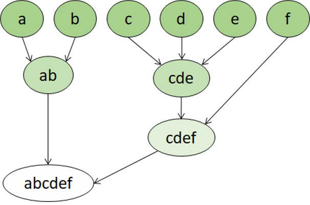

```{r setup, include=FALSE, eval=T}
knitr::opts_chunk$set(warning = F, message = F)
library(tidyverse)
library(tidymodels)
library(skimr)
library(plotly)
library(here)
# slice <- dplyr::slice
# eval_metrics <- metric_set(rmse, rsq)

```

## Buckle up 🚀

In this learning path, we'll learn how to create Machine learning models using `R` 😊. Machine learning is the foundation for predictive modeling and artificial intelligence. We'll learn the core principles of machine learning and how to use common tools and frameworks to train, evaluate, and use machine learning models.

Modules that will be covered in this learning path include:

-   Explore and analyze data with R

-   Train and evaluate regression models

-   Train and evaluate classification models

-   Train and evaluate clustering models

-   *Train and evaluate deep learning models (work in progress)*

### **Prerequisites**

This learning path assumes knowledge of basic mathematical concepts. Some experience with `R and the tidyverse` is also beneficial though we'll try as much as possible to skim through the core concepts. To get started with R and the tidyverse, the best place would be [R for Data Science](http://r4ds.had.co.nz/) an O'Reilly book written by Hadley Wickham and Garrett Grolemund. It's designed to take you from knowing nothing about R or the tidyverse to having all the basic tools of data science at your fingertips.

The `Python` edition of the learning path can be found at [this learning path](https://docs.microsoft.com/en-us/learn/paths/create-machine-learn-models/).

**Why R?**

> R has emerged over the last couple decades as a first-class tool for scientific computing tasks, and has been a consistent leader in implementing statistical methodologies for analyzing data. The usefulness of R for data science stems from the large, active, and growing ecosystem of third-party packages: `tidyverse` for common data analysis activities;`h2o`, `ranger`, `xgboost`, and others for fast and scalable machine learning; `iml`, `pdp`, `vip`, and others for machine learning interpretability; and many more tools will be mentioned throughout the pages that follow. - [`Boehmke & Greenwell (2019) Hands-On Machine Learning with R`](https://bradleyboehmke.github.io/HOML/)

Now, let's get started!

{width="569"}

## A gentle introduction to clustering

*`Clustering`* is a form of *`unsupervised`* machine learning in which observations are `grouped into clusters` based on `similarities` in their data values, or *features*. This kind of machine learning is considered unsupervised because it does not make use of previously known *label* values to train a model; in a clustering model, the label is the cluster to which the observation is assigned, based purely on its features.

Clustering works by separating the training cases based on similarities that can be determined from their feature values. Perhaps the two best-known clustering approaches are: `K-means clustering` and `hierarchical clustering`. In K-means clustering, we seek to partition the observations into a pre-specified number of clusters. On the other hand, in hierarchical clustering, we do not know in advance how many clusters we want.

Think of it this way; the numeric features of a given entity can be thought of as vector coordinates that define the entity's position in n-dimensional space. What a clustering model seeks to do is to identify groups, or *clusters*, of entities that are close to one another while being separated from other clusters.

For example, suppose a botanist observes a sample of flowers and records the number of petals and leaves on each flower.

[{width="400"}](https://docs.microsoft.com/en-us/learn/modules/train-evaluate-cluster-models/2-what-is-clustering)

It may be useful to group these flowers into clusters based on similarities between their features.

There are many ways this could be done. For example, if most flowers have the same number of leaves, they could be grouped into those with many vs few petals. Alternatively, if both petal and leaf counts vary considerably there may be a pattern to discover, such as those with many leaves also having many petals. The goal of the clustering algorithm is to find the optimal way to split the dataset into groups. What 'optimal' means depends on both the algorithm used and the dataset that is provided.

Although this flower example may be simple for a human to achieve with only a few samples, as the dataset grows to thousands of samples or to more than two features, clustering algorithms become very useful to quickly dissect a dataset into groups.

The best way to learn about clustering is to try it for yourself, so that's what you'll do in this exercise.

> We'll require some packages to knock-off this module. You can have them installed as: `install.packages(c('tidyverse', 'tidymodels', 'skimr', 'here', 'plotly', 'factoextra', 'cluster'))`

Alternatively, the script below checks whether you have the packages required to complete this module and installs them for you in case some are missing.

```{r}
suppressWarnings(if(!require("pacman")) install.packages("pacman"))

pacman::p_load('tidyverse', 'tidymodels', 'skimr', 'here', 'plotly', 'factoextra', 'cluster')

```

## 1. Principal Component Analysis (PCA)

Let's take a look at a dataset that contains measurements of different species of wheat seed.

> **Citation**: The seeds dataset used in the this exercise was originally published by the Institute of Agrophysics of the Polish Academy of Sciences in Lublin, and can be downloaded from the UCI dataset repository (Dua, D. and Graff, C. (2019). [UCI Machine Learning Repository](http://archive.ics.uci.edu/ml%5D). Irvine, CA: University of California, School of Information and Computer Science).

```{r read_url, message=F, warning=F}
# Load the core tidyverse and make it available in your current R session
library(tidyverse)

# Read the csv file into a tibble
seeds <- read_csv(file = "https://raw.githubusercontent.com/MicrosoftDocs/ml-basics/master/data/seeds.csv")

# Print the first 10 rows of the data
seeds %>% 
  slice_head(n = 5)


```

Sometimes, we may want some little more information on our data. We can have a look at the `data`, `its structure` and the `data type` of its features by using the [*glimpse()*](https://pillar.r-lib.org/reference/glimpse.html) function as below:

```{r}
# Explore dimension and type of columns
seeds %>% 
  glimpse()
```

While at it, let's use `skimr::skim()` to take a look at the summary statistics for the data

```{r summary_stats}
library(skimr)

# Obtain Summary statistics
seeds %>% 
  skim()

```

🤩Take a moment and go through the quick data exploration we just performed. Do we have any missing values? What's the dimension of our data (rows and columns)? What are the different column types? How are the values in our columns distributed?

For this module, we'll work with the first 6 `feature` columns. For **plotting** purposes, let's encode the *label* column as categorical. Tidymodels provides a neat way of excluding this variable when fitting a model to our data. Remember, we are dealing with unsupervised learning - which does not make use of previously known *label* values to train a model.

```{r select}
# Narrow down to desired features
seeds_select <- seeds %>% 
  select(!groove_length) %>% 
  mutate(species = factor(species))

# View first 5 rows of the data
seeds_select %>% 
  slice_head(n = 5)

```

As you can see, we now have six data points (or *features*) for each instance (*observation*) of a seed's species. So you could interpret these as coordinates that describe each seed's location in six-dimensional space.

Now, of course six-dimensional space is difficult to visualise in a three-dimensional world, or on a two-dimensional plot; so we'll take advantage of a mathematical technique called *`Principal Component Analysis`* (PCA) to analyze the relationships between the features and summarize each observation as coordinates for two principal components - in other words, we'll translate the six-dimensional feature values into two-dimensional coordinates.

*`Principal Component Analysis`* (PCA) is a dimension reduction method that aims at reducing the feature space, such that, most of the information or variability in the data set can be explained using fewer uncorrelated features.

> PCA works by receiving as input P variables (in this case six) and calculating the normalized linear combination of the P variables. This new variable is the linear combination of the six variables that captures the greatest variance out of all of them. PCA continues to calculate other normalized linear combinations **but** with the constraint that they need to be `completely uncorrelated` to all the other normalized linear combinations. Please see:
>
> -   [Principal Component Analysis](https://bradleyboehmke.github.io/HOML/pca.html), Boehmke & Greenwell, Hands-On Machine Learning with R
>
> -   [Unsupervised Methods](https://cimentadaj.github.io/ml_socsci/unsupervised-methods.html), Jorge Cimentada Machine, Learning for Social Scientist.
>
> for further reading.

Let's see this in action by creating a specification of a `recipe` that will estimate the *principal components* based on our six variables. We'll then `prep` and`bake` the recipe to apply the computations.

> PCA works well when the variables are normalized (`centered` and `scaled`)

```{r pca_prep}
# Specify a recipe for pca
pca_rec <- recipe(~ ., data = seeds_select) %>% 
  update_role(species, new_role = "ID") %>% 
  step_normalize(all_predictors()) %>% 
  step_pca(all_predictors(), num_comp = 2, id = "pca")

# Print out recipe
pca_rec

```

Compared to supervised learning techniques, we have no `outcome` variable in this recipe.

By updating the role of the `species` column to `ID`, this tells the recipe to keep the variable but not use it as either an outcome or predictor.

By calling `prep()` which estimates the statistics required by PCA and applying them to `seeds_features` using `bake(new_data = NULL)`, we can get the fitted PC transformation of our features.

```{r bake}
# Estimate required statistcs 
pca_estimates <- prep(pca_rec)

# Return preprocessed data using bake
features_2d <- pca_estimates %>% 
  bake(new_data = NULL)

# Print baked data set
features_2d %>% 
  slice_head(n = 5)

```

🤩 These two components capture the maximum amount of information (i.e. variance) in the original variables. From the output of our prepped recipe `pca_estimates`, we can examine how much variance each component accounts for:

```{r variance}
# Examine how much variance each PC accounts for
pca_estimates %>% 
  tidy(id = "pca", type = "variance") %>% 
  filter(str_detect(terms, "percent"))


theme_set(theme_light())
# Plot how much variance each PC accounts for
pca_estimates %>% 
  tidy(id = "pca", type = "variance") %>% 
  filter(terms == "percent variance") %>% 
  ggplot(mapping = aes(x = component, y = value)) +
  geom_col(fill = "midnightblue", alpha = 0.7) +
  ylab("% of total variance")
```

This output tibbles and plots shows how well each principal component is explaining the original six variables. For example, the first principal component (PC1) explains about `72%` of the variance of the six variables. The second principal component explains an additional `16.97%`, giving a cumulative percent variance of `89.11%`. This is certainly better. It means that the first two variables seem to have some power in summarizing the original six variables.

Naturally, the first PC (PC1) captures the most variance followed by PC2, then PC3, etc.

Now that we have the data points translated to two dimensions PC1 and PC2, we can visualize them in a plot:

```{r pca_plot}
# Visualize PC scores
features_2d %>% 
  ggplot(mapping = aes(x = PC1, y = PC2)) +
  geom_point(size = 2, color = "dodgerblue3")

```

Hopefully you can see at least two, arguably three, reasonably distinct groups of data points; but here lies one of the fundamental problems with clustering - without known class labels, how do you know how many clusters to separate your data into?

One way we can try to find out is to use a data sample to create a series of clustering models with an incrementing number of clusters, and measure how tightly the data points are grouped within each cluster. A metric often used to measure this tightness is the *within cluster sum of squares* (WCSS), with lower values meaning that the data points are closer. You can then plot the WCSS for each model.

We'll use the built-in `kmeans()` function, which accepts a data frame with all numeric columns as it's primary argument to perform clustering - means we'll have to drop the *species* column. For clustering, it is [recommended](https://developers.google.com/machine-learning/clustering/prepare-data) that the data have the same scale. We can use the recipes package to perform these transformations.

```{r clustering}
# Drop target column and normalize data
seeds_features<- recipe(~ ., data = seeds_select) %>% 
  step_rm(species) %>% 
  step_normalize(all_predictors()) %>% 
  prep() %>% 
  bake(new_data = NULL)

# Print out data
seeds_features %>% 
  slice_head(n = 5)
```

Now, let's explore the WCSS of different numbers of clusters.

We'll get to use `map()` from the [purrr](https://purrr.tidyverse.org/) package to apply functions to each element in list.

> [`map()`](https://purrr.tidyverse.org/reference/map.html) functions allow you to replace many for loops with code that is both more succinct and easier to read. The best place to learn about the [`map()`](https://purrr.tidyverse.org/reference/map.html) functions is the [iteration chapter](http://r4ds.had.co.nz/iteration.html) in R for data science.
>
> `broom::augment.kmeans()` accepts a model object and returns a tibble with exactly one row of model summaries. The summaries are typically goodness of fit measures, p-values for hypothesis tests on residuals, or model convergence information.

```{r}
set.seed(2056)
# Create 10 models with 1 to 10 clusters
kclusts <- tibble(k = 1:10) %>% 
  mutate(
    model = map(k, ~ kmeans(x = seeds_features, centers = .x, nstart = 20)),
    glanced = map(model, glance)) %>% 
  unnest(cols = c(glanced))

# View results
kclusts

# Plot Total within-cluster sum of squares (tot.withinss)
kclusts %>% 
  ggplot(mapping = aes(x = k, y = tot.withinss)) +
  geom_line(size = 1.2, alpha = 0.5, color = "dodgerblue3") +
  geom_point(size = 2, color = "dodgerblue3")
```

We seek to **minimize** the the total within-cluster sum of squares, by performing K-means clustering. The plot shows a large reduction in WCSS (so greater *tightness*) as the number of clusters increases from one to two, and a further noticable reduction from two to three clusters. After that, the reduction is less pronounced, resulting in an `elbow` 💪in the chart at around three clusters. This is a good indication that there are two to three reasonably well separated clusters of data points.

## 2. K-Means Clustering

The algorithm we used to approximate the number of clusters in our data set is called *K-Means*. Let's get to the finer details, shall we?

K-Means is a commonly used clustering algorithm that separates a dataset into *K* clusters of equal variance such that observations within the same cluster are as similar as possible (i.e., high intra-class similarity), whereas observations from different clusters are as dissimilar as possible (i.e., low inter-class similarity). The number of clusters, *K*, is user defined.

The basic algorithm has the following steps:

1.  Specify the number of clusters to be created (this is done by the analyst). Taking the flowers example we used at the beginning of the lesson, this means deciding how many clusters you want to use to group the flowers.
2.  Next, the algorithm randomly selects K observations from the data set to serve as the initial centers for the clusters (i.e., centroids).
3.  Next, each of the remaining observations (in this case flowers) are assigned to its closest centroid.
4.  Next, the new means of each cluster is computed and the centroid is moved to the mean.
5.  Now that the centers have been recalculated, every observation is checked again to see if it might be closer to a different cluster. All the objects are reassigned again using the updated cluster means. The cluster assignment and centroid update steps are iteratively repeated until the cluster assignments stop changing (i.e., when convergence is achieved). Typically, the algorithm terminates when each new iteration results in negligible movement of centroids and the clusters become static.
6.  Note that due to randomization of the initial k observations used as the starting centroids, we can get slightly different results each time we apply the procedure. For this reason, most algorithms use several *random starts* and choose the iteration with the lowest WCSS. As such, it is strongly recommended to always run K-Means with several values of *nstart* to avoid an *undesirable local optimum.*

So training usually involves multiple iterations, reinitializing the centroids each time, and the model with the best (lowest) WCSS is selected. The following animation shows this process:

{width="600"}

Now, back to our seeds example. After creating a series of clustering models with different numbers of clusters and plotting the WCSS across the clusters, we noticed a bend at around `k = 3`. This bend indicates that additional clusters beyond the third have little value and that there are two to three reasonably well separated clusters of data points.

So, let's perform *K-Means* clustering specifying `k = 3` clusters and add the classifications to the data set using `augment`.

```{r finalize model}
set.seed(2056)
# Fit and predict clusters with k = 3
final_kmeans <- kmeans(seeds_features, centers = 3, nstart = 100, iter.max = 1000)

# Add cluster prediction to the data set
results <- augment(final_kmeans, seeds_features) %>% 
# Bind pca_data - features_2d
  bind_cols(features_2d)

results %>% 
  slice_head(n = 5)

```

Let's see those cluster assignments with the two dimensional data points. We'll add some touch of interactivity using the [plotly package](https://plotly.com/r/getting-started/), so feel free to hover.

```{r cluster_plot1}
# Plot km_cluster assignmnet on the PC data
cluster_plot <- results %>% 
  ggplot(mapping = aes(x = PC1, y = PC2)) +
  geom_point(aes(shape = .cluster), size = 2) +
  scale_color_manual(values = c("darkorange","purple","cyan4"))

# Make plot interactive
ggplotly(cluster_plot)

```

🤩🤩 Hopefully, the data has been separated into three distinct clusters.

So what's the practical use of clustering? In some cases, you may have data that you need to group into distict clusters without knowing how many clusters there are or what they indicate. For example a marketing organization might want to separate customers into distinct segments, and then investigate how those segments exhibit different purchasing behaviors.

Sometimes, clustering is used as an initial step towards creating a classification model. You start by identifying distinct groups of data points, and then assign class labels to those clusters. You can then use this labelled data to train a classification model.

In the case of the seeds data, the different species of seed are already known and encoded as 0 (*Kama*), 1 (*Rosa*), or 2 (*Canadian*), so we can use these identifiers to compare the species classifications to the clusters identified by our unsupervised algorithm

```{r cluster_sp}
# Plot km_cluster assignmnet on the PC data
clust_spc_plot <- results %>% 
  ggplot(mapping = aes(x = PC1, y = PC2)) +
  geom_point(aes(shape = .cluster, color = species), size = 2, alpha = 0.8) +
  scale_color_manual(values = c("darkorange","purple","cyan4"))

# Make plot interactive
ggplotly(clust_spc_plot)
```

There may be some differences between the cluster assignments and class labels as shown by the different colors (species) within each cluster (shape). But the K-Means model should have done a reasonable job of clustering the observations so that seeds of the same species are generally in the same cluster. 💪

## 3. Hierarchical clustering

The first step in K-Means clustering is the data scientist specifying the number of clusters *K* to partition the observations into. Hierarchical clustering is an alternative approach which does not require the number of clusters to be defined in advance. Furthermore, hierarchical clustering results can be easily visualized using an attractive tree-based representation called a *dendrogram*. Once the dendrogram has been constructed, we slice this structure horizontally to identify the clusters formed.

Hierarchical clustering creates clusters by either a *divisive* method or *agglomerative* method. The `divisive` method is a `top down` approach starting with the entire dataset and then finding partitions in a stepwise manner. `Agglomerative clustering` is a `bottom up` approach. In this lab you will work with agglomerative clustering, commonly referred to as `AGNES` (AGglomerative NESting), which roughly works as follows:

1.  The linkage distances between each of the data points is computed.

2.  Points are clustered pairwise with their nearest neighbor.

3.  Linkage distances between the clusters are computed.

4.  Clusters are combined pairwise into larger clusters.

5.  Steps 3 and 4 are repeated until all data points are in a single cluster.

A fundamental question in hierarchical clustering is: *How do we measure the dissimilarity between two clusters of observations?* The linkage function/aggromeration methods can be computed in a number of ways:

-   Ward's minimum variance method: Minimizes the total within-cluster variance. At each step the pair of clusters with the smallest between-cluster distance are merged. Tends to produce more compact clusters.

-   Average linkage uses the mean pairwise distance between the members of the two clusters. Can vary in the compactness of the clusters it creates.

-   Complete or Maximal linkage uses the maximum distance between the members of the two clusters. Tends to produce more compact clusters.

Several different distance metrics are used to compute linkage functions:

-   Euclidian or l2 distance is the most widely used. This is the only metric for the Ward linkage method.

-   Manhattan or l1 distance is robust to outliers and has other interesting properties.

-   Cosine similarity, is the dot product between the location vectors divided by the magnitudes of the vectors. Notice that this metric is a measure of similarity, whereas the other two metrics are measures of difference. Similarity can be quite useful when working with data such as images or text documents.

> Please see:
>
> -   [*Hierarchical clustering*](https://bradleyboehmke.github.io/HOML/hierarchical.html), Boehmke & Greenwell, Hands-On Machine Learning with R
>
> -   *Unsupervised Learning*, [An Introduction to Statistical Learning with Applications in R](https://www.statlearning.com/)
>
> -   [Unsupervised Learning](https://emilhvitfeldt.github.io/ISLR-tidymodels-labs/index.html), An Introduction to Statistical Learning with Applications in R, Tidymodels spin-off.
>
> for further reading.

Therefore, in Hierarchical clustering, the clusters themselves belong to a larger group, which belong to even larger groups, and so on. This is useful for not only breaking data into groups, but understanding the relationships between these groups.

For example, if we apply clustering to the meanings of words, we may get a group containing adjectives specific to emotions ('angry', 'happy', and so on), which itself belongs to a group containing all human-related adjectives ('happy', 'handsome', 'young'), and this belongs to an even higher group containing all adjectives ('happy', 'green', 'handsome', 'hard' etc.).

{width="550"}

### Agglomerative Clustering

Let's see an example of clustering the seeds data using an agglomerative clustering algorithm. There are many functions available in R for hierarchical clustering.

The [`hclust()`](https://rdrr.io/r/stats/hclust.html) function is one way to perform hierarchical clustering in R. It only needs one input and that is a distance matrix structure computed using distance metrics (e.g euclidean) as produced by [`dist()`](https://rdrr.io/pkg/factoextra/man/dist.html). `hclust()` also allows us to specify the agglomeration method to be used (i.e. `"complete"`, `"average"`, `"single"`, or `"ward.D"`).

Great! Let's fit multiple hierarchical clustering models based on different aggromeration methods and see how the choice in aggromeration method changes the clustering.

```{r hclust}
# For reproducibility
set.seed(2056)

# Distance between observations matrix
d <- dist(x = seeds_features, method = "euclidean")

# Hierarchical clustering using Complete Linkage
seeds_hclust_complete <- hclust(d, method = "complete")

# Hierarchical clustering using Average Linkage
seeds_hclust_average <- hclust(d, method = "average")

# Hierarchical clustering using Ward Linkage
seeds_hclust_ward <- hclust(d, method = "ward.D2")
```

The [factoextra](https://rpkgs.datanovia.com/factoextra/index.html) provides functions ([`fviz_dend()`](https://rdrr.io/pkg/factoextra/man/fviz_dend.html)) to visualize hierarchical clustering. Let's visualize the dendrogram representation of the clusters starting with Complete aggromeration method.

```{r complete_viz}
library(factoextra)

# Visualize cluster separations
fviz_dend(seeds_hclust_complete, main = "Complete Linkage")

```

What about Average linkage?

```{r average_viz}
# Visualize cluster separations
fviz_dend(seeds_hclust_average, main = "Average Linkage")
```

Lastly, the ward linkage.

```{r ward_viz}
# Visualize cluster separations
fviz_dend(seeds_hclust_ward, main = "Ward Linkage")

```

> **Note:** If you are new to dendograms please see the following resources on how to interpret dendrograms:
>
> -   [*What is a Dendrogram?*](https://www.displayr.com/what-is-dendrogram/), Display R Blog
>
> -   [Hierarchical clustering explained](https://towardsdatascience.com/hierarchical-clustering-explained-e59b13846da8)

Perfect! Take a moment and analyze the nature of the clusters.

This can be done mathematically by evaluating the *aggromerative coefficient (AC)*, which measures the clustering structure of the dataset- with values closer to 1 suggest a more balanced clustering structure and values closer to 0 suggest less well-formed clusters. `cluster::agnes()` allows us to compute the hierarchical clustering as well as this metric too.

```{r AC}
library(cluster)
#Compute ac values
ac_metric <- list(
  complete_ac = agnes(seeds_features, metric = "euclidean", method = "complete")$ac,
  average_ac = agnes(seeds_features, metric = "euclidean", method = "average")$ac,
  ward_ac = agnes(seeds_features, metric = "euclidean", method = "ward")$ac
)

ac_metric

```

As we explained earlier, complete and ward linkages tend to produce tight clustering of objects.

Now, let's determine the optimal number of clusters. Although hierarchical clustering does not require one to pre-specify the number of clusters, one still needs to specify the number of clusters to extract. Let's use the *WCSS* method to determine the optimal number of clusters.

```{r hcut}
# Determine and visuzalize optimal n.o of clusters
#  hcut (for hierarchical clustering)
fviz_nbclust(seeds_features, FUNcluster = hcut, method = "wss")

```

Just like in K-Means clustering, the optimal number of clusters for this data set is 3.

Let's color our dendrogram according to k = 3 and observe how observations will be grouped. We'll go with the *ward* linkage method.

```{r}
# Visualize clustering structure for 3 groups
fviz_dend(seeds_hclust_ward, k = 3, main = "Ward Linkage")
```

Plausible enough 🤩!

We can now go ahead and `cut` the hierarchical clustering model into three clusters and extract the cluster labels for each observation associated with a given cut. This is done using `cutree()`

```{r cutree}
# Hierarchical clustering using Ward Linkage
seeds_hclust_ward <- hclust(d, method = "ward.D2")

# Group data into 3 clusters
results_hclust <- tibble(
  cluster_id = cutree(seeds_hclust_ward, k = 3)) %>% 
  mutate(cluster_id = factor(cluster_id)) %>% 
  bind_cols(features_2d)

results_hclust %>% 
  slice_head(n = 5)

```

We could probably do a little comparison between *K-Means* and *Hierarchical clustering* by counting the number of observations of each species in the corresponding clusters.

```{r}
# Compare k-m and hc
results_hclust %>% 
  count(species, cluster_id) %>% 
  rename(n_hclust = n) %>% 
  bind_cols(results %>% 
              count(species, .cluster) %>%
              select(!species) %>% 
              rename(n_kmclust = n))
            
```

Ignoring the cluster_id and .cluster column since they are arbitrary, we can see that the observations were grouped quite similarly by the two algorithms. We could of course make a confusion matrix to better visualize this, but we'll leave it at that for now.

Let's wrap it up by making some plots showing how our observations were grouped into clusters.🥳

```{r}
# Plot h-cluster assignmnet on the PC data
hclust_spc_plot <- results_hclust %>% 
  ggplot(mapping = aes(x = PC1, y = PC2)) +
  geom_point(aes(shape = cluster_id, color = species), size = 2, alpha = 0.8) +
  scale_color_manual(values = c("darkorange","purple","cyan4"))

# Make plot interactive
ggplotly(hclust_spc_plot)
```

## **4. Summary**

In this module, you learned how clustering can be used to create unsupervised machine learning models that group data observations into clusters. You then used the `Tidymodels` framework in R to perform dimension reduction using PCA and various packages in the R ecosystem such as `stats::kmeans()`, `stats::hclust()`, `cluster::agnes()` to train *K-Means* and *Hierarchical* clustering models.

While `Tidymodels` (R) and `scikit-learn` (Python) are popular framework for writing code to train clustering models, you can also create machine learning solutions for clustering using the graphical tools in Microsoft Azure Machine Learning. You can learn more about no-code development of clustering models using Azure Machine Learning in the [Create a clustering model with Azure Machine Learning designer](https://docs.microsoft.com/en-us/learn/modules/create-clustering-model-azure-machine-learning-designer/) module.

#### **Challenge: Cluster Unlabelled Data**

Now that you've seen how to create a clustering model, why not try for yourself? You'll find a clustering challenge in the [04 - Clustering Challenge.ipynb](https://github.com/MicrosoftDocs/ml-basics/blob/master/challenges/04%20-%20Clustering%20Challenge.ipynb) notebook!

#### THANK YOU TO:

`Allison Horst` for creating the amazing illustrations that make R more welcoming and engaging. Find more illustrations at her [gallery](https://www.google.com/url?q=https://github.com/allisonhorst/stats-illustrations&sa=D&source=editors&ust=1626380772530000&usg=AOvVaw3zcfyCizFQZpkSLzxiiQEM).

`Bethany`, *Gold Microsoft Learn Student Ambassador*, for her valuable feedback and suggestions.

#### FURTHER READING

-   Bradley Boehmke & Brandon Greenwell, [*Hands-On Machine Learning with R*](https://bradleyboehmke.github.io/HOML/)*.*

-   Gareth James, Daniela Witten, Trevor Hastie, Robert Tibshirani. [*An introduction to statistical learning : with applications in R*](https://www.statlearning.com/)*.* **Corresponding Tidymodels labs by Emil Hvitfeldt can be found** [*here*](https://emilhvitfeldt.github.io/ISLR-tidymodels-labs/index.html)*.*

-   Jorge Cimentada, [*Machine Learning for Social Scientists*](https://cimentadaj.github.io/ml_socsci/)*.*

-   Allison Horst's [*PCA with penguins and recipes*](https://allisonhorst.github.io/palmerpenguins/articles/articles/pca.html)*.*

-   Max Kuhn and Julia Silge, [*Tidy Modeling with R*](https://www.tmwr.org/)*.*

-   Tidymodels [reference website](https://www.tidymodels.org/start/).

-   H. Wickham and G. Grolemund, [*R for Data Science: Visualize, Model, Transform, Tidy, and Import Data*](https://r4ds.had.co.nz/).

Happy leaRning,

[Eric (R_ic)](https://twitter.com/ericntay), *Gold Microsoft Learn Student Ambassador*.
